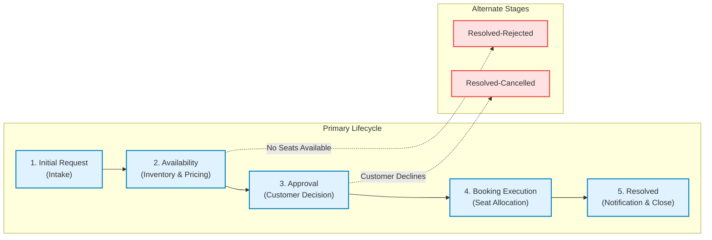

# 🎬 Movie Ticket Booking Management System (`NIP-MovieTicket-SameerKumar`)

An Enterprise Low-Code Application built on **Pega Platform (v24 / v8)** using **Pega GenAI Blueprint** for the **National Internship Portal (NIP)** Project Submission.

---

## 📌 Project & Student Details

| Field | Detail |
|---|---|
| **Student Name** | **Sameer Kumar** |
| **Pega Application Name** | `NIP-MovieTicket-SameerKumar` |
| **Case Type Name** | `Movie Ticket Request` (`SL-Ticketing_4-Work-MovieTicketRequest`) |
| **Operator ID** | `Sameer.Kumar` (Logged-in Operator: Sameer Kumar) |
| **Application Version** | `01.01.01` (Alias: `ticketing-booking`) |
| **Project Track** | Movie Ticket Booking Management Application |
| **Pega Instance URL** | `https://pega8-trial.pegacloud.io/prweb` |
| **Submission Document** | [`MovieTicket_Sameer_Kumar.docx`](MovieTicket_Sameer_Kumar.docx) |

---

## 📂 Repository Contents

This repository contains the complete submission package for the Pega Low-Code Application project:

```text
├── MovieTicket_Sameer_Kumar.docx  # Official NIP submission document with all 10 real Pega screenshots & technical Q&A
└── README.md                      # Comprehensive project documentation, case lifecycle & technical specifications
```

---

## 🏗️ Case Lifecycle & Stage Architecture

The **Movie Ticket Request** case lifecycle automates ticket reservation, capacity validation, dynamic cost calculation, customer approval, and ticket generation across 5 primary stages and 2 alternate resolution paths:



### Stage-by-Stage Workflow

1. **Stage 1: Initial Request (Intake)**
   - Collects Customer Name (`.CustomerName`), Email (`.CustomerEmail`), Movie Name (`.MovieName`), Show Date (`.ShowDate`), Show Time (`.ShowTime`), Show Type (`.ShowType`), and Number of Tickets (`.NumberOfTickets`).
   - Validates that the selected show date is in the future and ticket quantity is between 1 and 10.

2. **Stage 2: Availability (Inventory & Pricing)**
   - Queries the `Show` data object to check current `.AvailableSeatsCount` against requested `.NumberOfTickets`.
   - Executes the **Declare Expression** to compute `.TotalCost = .TicketPrice * .NumberOfTickets`.
   - If seats are unavailable, transitions to alternate stage `Resolved-Rejected`.

3. **Stage 3: Approval (Quote Confirmation)**
   - Presents a structured quote to the **Customer** persona with decision branching.
   - If confirmed, routes to *Booking Execution*; if rejected, branches to `Resolved-Cancelled`.

4. **Stage 4: Booking Execution (Fulfillment & Routing)**
   - Conditional routing directs **IMAX / 4DX** screenings to `PremiumShowQueue` and standard screenings to `StandardShowQueue`.
   - The booking agent allocates `.SeatNumbers` (e.g., `P10, P11, P12`) and generates a unique `.TicketID` (e.g., `TKT-2026-100001`).

5. **Stage 5: Resolved (Notification & Closure)**
   - Automated **SendEmail** correspondence (`BookingConfirmationNotice`) sends the booking confirmation and digital pass.
   - Updates case status to `Resolved-Completed`.

---

## 📊 Data Model & Declarative Processing

### 1. Reusable Data Objects
- **Movie (`SL-Ticketing_4-Data-Movie`)**:
  - `pyGUID` *(Text - Key)*: Unique identifier.
  - `MovieName` *(Text)*: Movie title.
  - `Genre` *(Text)*: Action, Drama, Sci-Fi, IMAX Documentary.
  - `Country by Code` *(Text)*: Regional release code.
- **Show (`SL-Ticketing_4-Data-Show`)**:
  - `pyGUID` *(Text - Key)*: Unique show identifier.
  - `Movie` *(Data Reference $\rightarrow$ Data-Movie)*: 1:N foreign reference to Movie.
  - `ShowDate` *(Date)* & `ShowTime` *(Time)*: Scheduled showtime.
  - `ShowType` *(PickList)*: Standard 2D, IMAX 3D, 4DX Premium.
  - `TicketPrice` *(Currency)*: Base admission price.
  - `SeatCapacity` *(Integer)* & `AvailableSeatsCount` *(Integer)*: Dynamic seat inventory.

### 2. Declare Expression Rule
- **Rule Name:** `CalculateTotalCost` (`Rule-Declare-Expressions`)
- **Target Property:** `.TotalCost`
- **Formula:** `.TotalCost = .TicketPrice * .NumberOfTickets`
- **Behavior:** Automatically updates in real time whenever ticket quantity or show type changes without procedural code.

---

## ⏱️ SLA & Routing Configuration

- **Service Level Agreement (`pyCaseTypeDefault` - `Rule-Obj-ServiceLevel`)**:
  - **Goal:** `1 Day` $\rightarrow$ Increases case urgency by `+10`.
  - **Deadline:** `2 Days` $\rightarrow$ Increases case urgency by `+20` and sends automated escalation notifications.
- **Work Queues**:
  - `PremiumShowQueue`: Routes IMAX and 4DX premium screenings to concierge operators.
  - `StandardShowQueue`: Routes standard screenings for general fulfillment.

---

## 📋 10 User Stories & Verification Matrix

The submission document [`MovieTicket_Sameer_Kumar.docx`](MovieTicket_Sameer_Kumar.docx) contains full running-case screenshot evidence for all 10 user stories:

| Story | User Story Title | What Was Built | Evidence in Docx |
|---|---|---|---|
| **US-001** | Submit Movie Ticket Request | Intake form with validations on customer email, future dates, and ticket quantities. | Case summary card with Sameer Kumar as Movie Name & Customer |
| **US-002** | Check Show Availability | Automated query against `Data-Show` inventory verifying seat availability count. | Stage 2 screen with Available Seats = 45 & Status = Available |
| **US-003** | Calculate Booking Cost | Declare Expression computing `.TotalCost = .TicketPrice * .NumberOfTickets`. | Auto-calculated Total Cost = $1,050.00 ($350 × 3 tickets) |
| **US-004** | Confirm Booking Request | Customer approval step with decision branching to execution or cancellation. | Stage 3 Approval screen with Confirmed status & details panel |
| **US-005** | Maintain Movie and Show Data | Reusable data model with 1:N relationship between Movie and Show data objects. | App Studio Data Model view showing Data-Movie & Data-Show |
| **US-006** | Review Booking Details | Read-only summary panel displaying show schedule, seat selection, and pricing. | Resolved Details table with complete booking breakdown |
| **US-007** | Process Ticket Booking | Execution step allocating seat numbers (`P10, P11, P12`) and generating `TicketID`. | Stage 4 execution form with Ticket ID TKT-2026-100001 |
| **US-008** | Notify Booking Confirmation | Automated `SendEmail` correspondence attached to case history upon resolution. | Case History audit log showing attached confirmation email |
| **US-009** | Define Booking SLA | Case-level SLA configured with 1-day Goal (+10 urgency) and 2-day Deadline (+20 urgency). | App Studio Goal & Deadline SLA configuration view |
| **US-010** | Route by Show Type | Workflow logic routing IMAX screenings to `PremiumShowQueue` and 2D to `StandardShowQueue`. | Business logic decision rule showing conditional queue routing |

---

## 📝 Technical Answers (Sections 3 & 4)

### Q1. Case Lifecycle Stages
`Initial Request, Availability, Approval, Booking Execution, Resolved`

### Q2. Data Objects & Properties
- **Movie (`Data-Movie`):** `MovieName` (Text), `Genre` (Text), `Country by Code` (Text), `pyGUID` (Text - Key).
- **Show (`Data-Show`):** `ShowDate` (Date), `ShowTime` (Time), `ShowType` (PickList), `TicketPrice` (Currency), `SeatCapacity` (Integer), `AvailableSeatsCount` (Integer), `Movie` (Data Reference).

### Q3. Total Cost Rule
- **Rule Name:** `CalculateTotalCost`
- **Rule Type:** Declare Expression (`Rule-Declare-Expressions`)
- **Properties:** `.TicketPrice`, `.NumberOfTickets`
- **Formula:** `.TotalCost = .TicketPrice * .NumberOfTickets`

### Q4. Blueprint Generation vs Custom Additions
Pega GenAI Blueprint generated the baseline case type, draft stages, and data object structures. On top of Blueprint, I configured the Declare Expression for real-time cost calculation, input validation rules for future dates/ticket counts, the Case SLA (1-day Goal / 2-day Deadline), conditional routing to `PremiumShowQueue`/`StandardShowQueue`, and the `SendEmail` correspondence template.

### Q5. Blueprint Corrections
Blueprint initially set `TotalCost` as a static manual input field. I converted it into a calculated read-only property governed by a Declare Expression (`.TotalCost = .TicketPrice * .NumberOfTickets`) so that total pricing updates automatically on ticket quantity or show type changes.

### Q6. End-to-End Case Flow
1. **Intake:** Customer inputs booking details and selects movie, showtime, and tickets.
2. **Availability Check:** System verifies available seats against capacity and computes total cost.
3. **Approval:** Customer confirms the booking quote.
4. **Execution:** Request routes to the appropriate work queue (`PremiumShowQueue`/`StandardShowQueue`) where seats (`P10, P11, P12`) and Ticket ID (`TKT-2026-100001`) are assigned.
5. **Resolution:** Status updates to `Resolved-Completed` and confirmation email is dispatched.

### Q7. Design Choices
1. **Declare Expression for Pricing:** Eliminates manual calculations and automatically maintains pricing consistency across all channels.
2. **Show Type Work Queue Routing:** Directs luxury IMAX/4DX bookings to specialized concierge queues to ensure fast turnaround for high-value customers.

### Q8. Hardest Challenge & Resolution
Configuring dynamic property lookups between the `Show` data reference and the case type. Resolved by parameterizing the lookup data page (`D_ShowLookup`) by show date/time/type and binding it to an On-Change client-side post-value action.

### Q9. Conditional Approval
Update the Approval step condition from *Always* to *Custom Condition* with the logic `.TotalCost > 1000`, allowing bookings under $1,000 to automatically skip approval.

### Q10. Three Exact Rule Names
1. `CalculateTotalCost` (`Rule-Declare-Expressions`)
2. `pyCaseTypeDefault` (`Rule-Obj-ServiceLevel`)
3. `BookingConfirmationNotice` (`Rule-Obj-Corr`)

### Q11. Personas
`Customer`, `BookingAgent` (Author), `Manager` (SecurityAdministrator).

### Q12. Work Queues
1. `PremiumShowQueue`: Handles IMAX, 4DX, and VIP screenings.
2. `StandardShowQueue`: Handles standard 2D and regular auditorium bookings.
