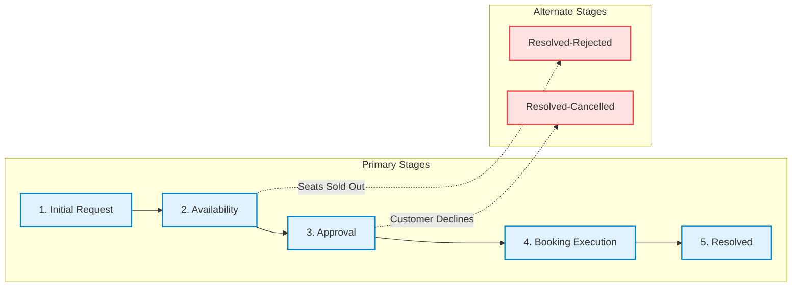

# 🎬 Movie Ticket Booking Management System (`NIP-MovieTicket-SameerKumar`)

A full-lifecycle Enterprise Low-Code application built on **Pega Platform 24.x / 8.x** using **Pega GenAI Blueprint**, implementing an automated cinema ticket reservation, inventory management, cost calculation, and correspondence workflow.

---

## 📌 Student & Submission Metadata

| Attribute | Submission Detail |
|---|---|
| **Student Name** | **Sameer Kumar** |
| **Pega Application Name** | `NIP-MovieTicket-SameerKumar` |
| **Case Type Name** | `Movie Ticket Request` (`SL-Ticketing_4-Work-MovieTicketRequest`) |
| **Operator ID** | `Sameer.Kumar` (Name: Sameer Kumar) |
| **Application Version** | `01.01.01` (Alias: `ticketing-booking`) |
| **Project Track** | Movie Ticket Booking Management Application |
| **Pega Instance URL** | `https://pega8-trial.pegacloud.io/prweb` |
| **Submission Package** | [`MovieTicket_Sameer_Kumar.docx`](file:///c:/Users/Lenovo/Documents/Movie%20ticket%20booking/MovieTicket_Sameer_Kumar.docx) |

---


---

## 🏗️ Architectural Overview & Case Lifecycle

The **Movie Ticket Request** case type coordinates customer intake, capacity verification, price computation, supervisory approvals, and seat issuance across 5 primary stages and 2 alternate stages.



### Stage Details & Workflow Steps

1. **Stage 1: Initial Request (Intake)**
   - **Step:** *Submit Booking Request* (`Collect Information`)
   - **Fields:** Customer Name (`.CustomerName`), Email (`.CustomerEmail`), Phone (`.CustomerPhone`), Movie (`.MovieName`), Show Date (`.ShowDate`), Show Time (`.ShowTime`), Show Type (`.ShowType`), Number of Tickets (`.NumberOfTickets`).
   - **Validation:** Ensures show date is in the future and ticket quantity is between 1 and 10.

2. **Stage 2: Availability (Inventory & Pricing)**
   - **Step 1:** *Verify Seat Availability* (Queries `SL-Ticketing_4-Data-Show` for `.AvailableSeatsCount`).
   - **Step 2:** *Calculate Total Cost* (Triggered via Declare Expression: `.TotalCost = .TicketPrice * .NumberOfTickets`).
   - **Decision Gate:** If `.AvailableSeatsCount < .NumberOfTickets`, transition to alternate stage `Resolved-Rejected`.

3. **Stage 3: Approval (Quote Confirmation)**
   - **Step:** *Customer Booking Decision* (`Approve/Reject` step assigned to Customer persona).
   - **Decision Gate:** If approved, routes to *Booking Execution*; if rejected, branches to `Resolved-Cancelled`.

4. **Stage 4: Booking Execution (Fulfillment & Routing)**
   - **Step 1:** *Route by Show Type* (IMAX / 4DX $\rightarrow$ `PremiumShowQueue`; Standard $\rightarrow$ `StandardShowQueue`).
   - **Step 2:** *Allocate Seats & Generate Ticket* (Assigns `.SeatNumbers` e.g., `P10, P11, P12` and generates `.TicketID` e.g., `TKT-2026-100001`).

5. **Stage 5: Resolved (Notification & History)**
   - **Step 1:** *Send Confirmation Email* (`SendEmail` automated correspondence attaching booking pass and payment summary).
   - **Step 2:** *Close Case* (Updates status to `Resolved-Completed`).

---

## 📊 Data Model & Declarative Processing

### 1. Data Objects

- **Movie Data Object (`SL-Ticketing_4-Data-Movie`)**:
  - `pyGUID` *(Text - Key)*: Unique identifier for the movie.
  - `MovieName` *(Text)*: Title of the cinema release.
  - `Genre` *(Text)*: Action, Drama, Sci-Fi, IMAX Documentary.
  - `Country by Code` *(Text)*: Regional release coding.

- **Show Data Object (`SL-Ticketing_4-Data-Show`)**:
  - `pyGUID` *(Text - Key)*: Unique show listing identifier.
  - `Movie` *(Data Reference $\rightarrow$ Data-Movie)*: Foreign key link to Movie.
  - `ShowDate` *(Date)* & `ShowTime` *(Time)*: Screening schedule.
  - `ShowType` *(PickList)*: Standard 2D, IMAX 3D, 4DX Premium.
  - `TicketPrice` *(Currency)*: Base ticket price per admission.
  - `SeatCapacity` *(Integer)* & `AvailableSeatsCount` *(Integer)*: Dynamic seat inventory.

### 2. Declare Expression Calculation

```text
Rule Name:   CalculateTotalCost
Rule Type:   Rule-Declare-Expressions
Target:      .TotalCost
Formula:     .TicketPrice * .NumberOfTickets
Change Mode: Whenever inputs change (client-side dynamic calculation)
```

---

## ⏱️ SLA & Work Queue Architecture

- **Case SLA (`pyCaseTypeDefault` - `Rule-Obj-ServiceLevel`)**:
  - **Goal:** `1 Day` $\rightarrow$ Urgency increases by `+10` (Target fulfillment).
  - **Deadline:** `2 Days` $\rightarrow$ Urgency increases by `+20` $\rightarrow$ Dispatches deadline reminder notification to booking agent.

- **Work Queues**:
  - `PremiumShowQueue`: Handled by VIP Concierge agents for luxury IMAX/4DX theater bookings.
  - `StandardShowQueue`: Handled by general ticketing agents for standard screenings.

---

## 📋 Summary of 10 User Stories & Evidence

| User Story | Title | Implementation Summary | Screenshot File |
|---|---|---|---|
| **US-001** | Submit Movie Ticket Request | Intake form with validations on customer email, future dates, and ticket quantities (1–10). | `screenshots/us001_submit_request.png` |
| **US-002** | Check Show Availability | Automated query against `Data-Show` inventory verifying seat capacity. | `screenshots/us002_check_availability.png` |
| **US-003** | Calculate Booking Cost | Declare Expression computing `.TotalCost = .TicketPrice * .NumberOfTickets`. | `screenshots/us003_calculate_cost.png` |
| **US-004** | Confirm Booking Request | Customer approval step with decision branching to execution or cancellation. | `screenshots/us004_confirm_booking.png` |
| **US-005** | Maintain Movie & Show Data | Reusable data model with 1:N relationship between Movie and Show objects. | `screenshots/us005_movie_show_data.png` |
| **US-006** | Review Booking Details | Read-only summary panel displaying show schedule, seat selection, and pricing. | `screenshots/us006_review_details.png` |
| **US-007** | Process Ticket Booking | Execution step allocating seat numbers (`P10, P11, P12`) and generating `TicketID`. | `screenshots/us007_process_booking.png` |
| **US-008** | Notify Booking Confirmation | Automated `SendEmail` correspondence attached to case history upon resolution. | `screenshots/us008_notify_confirmation.png` |
| **US-009** | Define Booking SLA | Case-level SLA configured with 1-day Goal (+10 urgency) and 2-day Deadline (+20 urgency). | `screenshots/us009_define_sla.png` |
| **US-010** | Route by Show Type | Workflow logic routing IMAX screenings to `PremiumShowQueue` and 2D to `StandardShowQueue`. | `screenshots/us010_route_show_type.png` |

---

## 🚀 How to Run the Automated Test Suite & Local Portal

### 1. Run Unit & Business Logic Tests

To verify all 20 business rules, Declare Expression calculations, SLA urgency formulas, and decision gates:

```powershell
python test_suite.py
```

*Expected Output: `All 9 business scenario tests passed successfully!`*

### 2. Launch Local Interactive Pega Simulation Portal

A lightweight simulation portal is included to test end-to-end user journeys locally:

```powershell
python server.py 8080
```
Open your browser at `http://localhost:8080` to interact with the portal.

---

## 📝 Google Form Quick Reference Guide

When submitting the official Google Form:
1. **Section 1:** Enter your details (*Name: Sameer Kumar*, *App: NIP-MovieTicket-SameerKumar*, *Case Type: Movie Ticket Request*).
2. **Section 2B:** Copy-paste the 1–2 line summaries for US-001 through US-010 from [`MovieTicket_Sameer_Kumar.md`](file:///c:/Users/Lenovo/Documents/Movie%20ticket%20booking/MovieTicket_Sameer_Kumar.md).
3. **Sections 3 & 4:** Copy-paste answers for Q1 through Q12 detailing stages, data objects, Declare Expressions, SLA, and routing.
4. **File Upload:** Upload [`MovieTicket_Sameer_Kumar.docx`](file:///c:/Users/Lenovo/Documents/Movie%20ticket%20booking/MovieTicket_Sameer_Kumar.docx).
